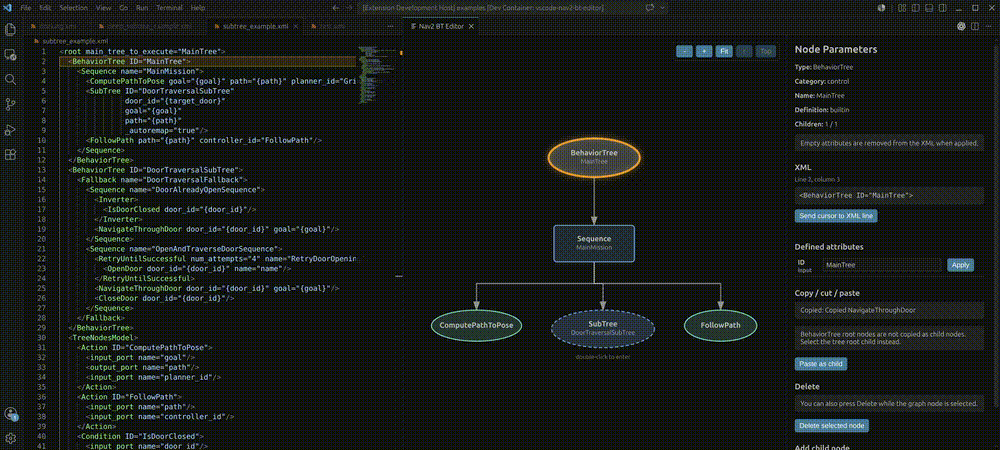

# Nav2 BT Editor for VS Code

Edit ROS 2 Nav2 and BehaviorTree.CPP XML behavior trees as an interactive graph inside Visual Studio Code.

Nav2 BT Editor is built for developers who work directly with Nav2 BT XML files, custom BehaviorTree.CPP nodes, `TreeNodesModel` definitions, and reusable SubTree definitions.



## Highlights

- Visualize `BehaviorTree` XML as an editable graph.
- Edit node attributes and write changes back to XML.
- Add child nodes from imported `TreeNodesModel` ports, built-in Nav2 fallback definitions, or custom tag names.
- Change a node to another compatible type without deleting and recreating it.
- Drag nodes to reorder siblings or move them under another valid parent.
- Use visible drop zones, green/red drag feedback, and snap-back for invalid drops.
- Navigate SubTrees one tree at a time, or expand SubTrees inline in one large graph.
- Import `TreeNodesModel` XML from local files or URLs.
- Import external `BehaviorTree` XML files as reusable SubTree templates.
- Copy, cut, paste, and delete nodes while preserving referenced SubTree definitions where still used.
- Detect malformed XML structure that would otherwise make leaf nodes appear to have children.

The extension edits XML. It does not execute behavior trees, tick nodes, connect to ROS 2, or replace runtime validation in Nav2.

## Commands

| Command | Description |
|---|---|
| `Nav2 BT Editor: Open Editor` | Open the visual behavior tree editor for the selected XML file. |
| `Nav2 BT Editor: Add TreeNodesModel Definitions from XML File` | Add node definitions from a local XML file. |
| `Nav2 BT Editor: Add TreeNodesModel Definitions from URL` | Add node definitions from a URL. |
| `Nav2 BT Editor: Add BehaviorTree SubTrees from XML File` | Add BehaviorTree definitions from a local XML file as SubTree templates. |
| `Nav2 BT Editor: Add BehaviorTree SubTrees from URL` | Add BehaviorTree definitions from a URL as SubTree templates. |
| `Nav2 BT Editor: Remove Selected TreeNodesModel Definitions` | Show stored TreeNodesModel definitions and remove selected entries. |
| `Nav2 BT Editor: Clear All TreeNodesModel Definitions` | Remove all stored TreeNodesModel definitions. |
| `Nav2 BT Editor: Remove Selected BehaviorTree SubTrees` | Show stored SubTree templates and remove selected entries. |
| `Nav2 BT Editor: Clear All BehaviorTree SubTrees` | Remove all stored SubTree templates. |

Command IDs use the `nav2-bt-editor.*` namespace. Settings use the `nav2BtEditor.*` namespace.

## Settings

- `nav2BtEditor.autoSaveEdits`
  Default: `true`. Automatically save the XML file after applying edits from the graph. When disabled, the editor buffer is updated but remains unsaved until you save it manually.

- `nav2BtEditor.allowEmptyAttributes`
  Default: `false`. Allow empty XML attributes when applying edits. When disabled, empty attributes are removed from the XML.

- `nav2BtEditor.openOnlyOneBehaviorTree`
  Default: `true`. Show only one `BehaviorTree` at a time. When disabled, SubTree nodes can be expanded inline.

- `nav2BtEditor.autoFitOnTreeChange`
  Default: `true`. Automatically fit the graph view after opening, closing, or navigating between BehaviorTrees. When disabled, the current zoom and pan are preserved.

- `nav2BtEditor.includeFullBehaviorTree`
  Default: `false`. When enabled, adding an imported BehaviorTree as a `SubTree` also inserts the full referenced `BehaviorTree` XML into the current file. When disabled, only the `SubTree` reference is inserted.

## Editing

Click a node in the graph to open its details panel.

For known nodes, the panel shows attributes and ports from the current XML file's `TreeNodesModel`, imported `TreeNodesModel` files, or the built-in fallback catalog. Unknown nodes remain editable with manual custom attributes.

Select a parent node and use the add-child controls in the details panel to add a known node type or custom XML tag.

Use the compatible type control to change a known action, condition, decorator, or control node to another node in the same category. Attributes that are still valid for the new node type are kept; unsupported attributes are removed. `BehaviorTree` roots and `SubTree` calls are not changed through this control.

When adding a `SubTree`, imported `BehaviorTree` templates appear in the SubTree list. Selecting one fills `ID` and `_autoremap="true"`.

By default, imported BehaviorTrees are inserted as reference-only SubTree calls:

```xml
<SubTree ID="InitTree" _autoremap="true" />
```

Enable `nav2BtEditor.includeFullBehaviorTree` to also insert the full referenced `BehaviorTree` XML.

## Drag And Drop

Drag a node to reorder it or move it under another valid parent.

Drop zones are shown while dragging. The dragged node turns green over a valid target and red outside valid targets. Invalid drops snap back without changing XML.

Cross-parent drops use the horizontal drop position to decide where the moved node is inserted among the target parent's children. Root XML nodes cannot be moved from the editor.

While dragging, hold the middle mouse button or `Alt` and move the mouse to pan the graph without dropping the node.

## SubTrees

By default, the editor shows one `BehaviorTree` at a time.

Double-click a `SubTree` node to enter the referenced `BehaviorTree` when that target exists in the current XML file. Missing or reference-only imported SubTrees do not show the double-click hint.

While dragging in one-tree mode, hover over a `SubTree` for about one second to enter it. Hover over the current `BehaviorTree` root node for about one second to go one tree up. The hovered navigation target is highlighted while the timer is pending.

Toolbar controls:

```text
Up    Go one BehaviorTree up
Top   Go back to the top-level BehaviorTree
Fit   Fit the current graph into view
+     Zoom in
-     Zoom out
```

Set `nav2BtEditor.openOnlyOneBehaviorTree` to `false` to expand SubTrees inline inside one larger graph. In this mode, double-click a SubTree to open or close it, or hover over a closed SubTree during drag for about one second to open it in place.

## Imports

Many Nav2 and custom BehaviorTree.CPP projects define node ports in a `TreeNodesModel` XML file. Import this file when you want exact ports for your Nav2 version or custom BT plugins.

GitHub blob URLs are converted to raw URLs automatically. Imported definitions are stored by VS Code and remembered across sessions. If a node name exists in both the built-in fallback catalog and imported definitions, the imported definition takes priority.

External `BehaviorTree` XML files can also be imported and reused when adding `SubTree` nodes. Each complete `BehaviorTree` with an `ID` is stored as a reusable template.

If `nav2BtEditor.includeFullBehaviorTree` is enabled and the selected template references other imported BehaviorTrees through nested SubTrees, those nested templates are inserted too.

## Compatibility

The editor is XML-focused and is intended to work with common Nav2 behavior trees using BehaviorTree.CPP 3.8-style and 4.x-style XML.

Supported XML patterns include:

- `BehaviorTree` roots with `ID` attributes
- `root BTCPP_format="4"` metadata
- `SubTree` and `SubTreePlus`
- common BehaviorTree.CPP controls, decorators, actions, and conditions
- Nav2 BT plugin node names from the built-in catalog
- custom nodes imported from `TreeNodesModel`
- BehaviorTree.CPP 4.x scripting and pre/post-condition attributes as normal XML attributes

The built-in catalog is a convenience fallback so common Nav2 trees are usable immediately after installation. It is not intended to be the authoritative definition of every Nav2 version or every plugin port. For exact project behavior, import the `TreeNodesModel` XML generated by or shipped with your Nav2/custom BT package.

Version-specific runtime semantics are not enforced. Unknown tags and unknown attributes are preserved so custom Nav2 plugins and project-specific ports remain editable.

## Install

Install **Nav2 BT Editor** from the Visual Studio Code Marketplace.

After installation, open a BehaviorTree.CPP XML file and run:

```text
Nav2 BT Editor: Open Editor
```

You can also right-click an XML file in the Explorer and select the same command.

## Naming

- Extension display name: `Nav2 BT Editor`
- Package and repository name: `vscode-nav2-bt-editor`
- Command ID namespace: `nav2-bt-editor.*`
- Settings namespace: `nav2BtEditor.*`

## Relationship

Nav2 BT Editor is an independent Visual Studio Code extension for BehaviorTree.CPP-style XML behavior trees, with a focus on ROS 2 and Nav2 workflows.

It is not affiliated with or endorsed by Groot, Groot2, BehaviorTree.CPP, Open Navigation LLC, or the Navigation2 project.

The extension does not bundle Groot, Groot2, BehaviorTree.CPP, or Nav2 source code. It uses a built-in fallback catalog of common BehaviorTree.CPP and Nav2 node names for first-run usability, and imported `TreeNodesModel` XML files should be used for exact project-specific node ports.

## License

See the repository `LICENSE` file.
