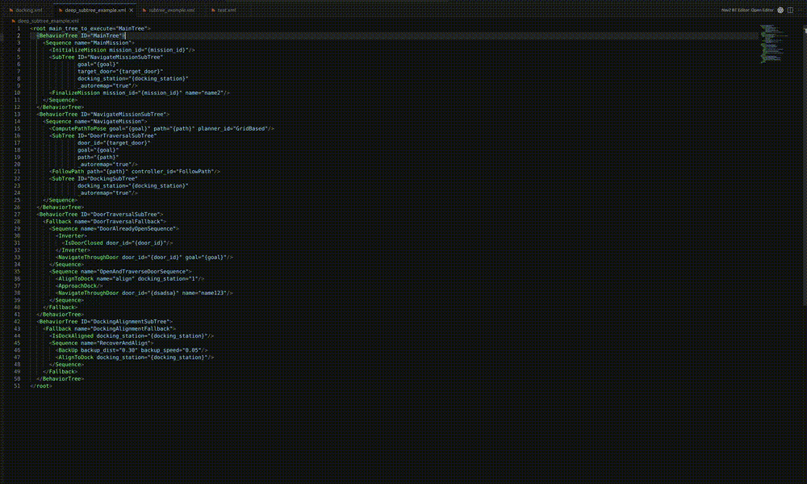

# Nav2 BT Editor for VS Code

Nav2 BT Editor is a Visual Studio Code extension for editing ROS 2 Nav2 and BehaviorTree.CPP XML behavior trees as an interactive graph.

It is built for developers who work directly with Nav2 BT XML files, custom BehaviorTree.CPP nodes, `TreeNodesModel` definitions, and reusable SubTree definitions.

## Install

Install **Nav2 BT Editor** from the Visual Studio Code Marketplace.

1. Open Visual Studio Code.
2. Open the Extensions view.
3. Search for `Nav2 BT Editor`.
4. Select the extension.
5. Click Install.

After installation, open a BehaviorTree.CPP XML file and run:

```text
Nav2 BT Editor: Open Editor
```

You can also right-click an XML file in the Explorer and select the same command.

## Demo



## What it does

- Renders BehaviorTree.CPP XML as an interactive tree graph.
- Edits node attributes and writes the changes back into the XML file.
- Adds new child nodes from known BehaviorTree.CPP/Nav2 node types or custom XML tag names.
- Reorders and moves nodes by dragging them in the graph and updates XML child order.
- Deletes nodes, including referenced nested BehaviorTree definitions when requested.
- Imports `TreeNodesModel` XML files from local files or URLs.
- Imports external `BehaviorTree` XML files as reusable SubTree templates.
- Inserts imported SubTrees either as a reference-only `<SubTree ID="..." _autoremap="true" />` node or with the full referenced `BehaviorTree` XML.
- Navigates between separate `BehaviorTree` definitions.
- Expands or collapses SubTree nodes inline when configured.
- Highlights unknown node types in the graph and details panel.
- Detects malformed XML structure that would otherwise make leaf nodes appear to have children.

The extension edits XML. It does not execute behavior trees, tick nodes, connect to ROS 2, or replace runtime validation in Nav2.

## BehaviorTree.CPP and Nav2 compatibility

The editor is XML-focused and is intended to work with common Nav2 behavior trees using BehaviorTree.CPP 3.8-style and 4.x-style XML.

Supported XML patterns include:

- `BehaviorTree` roots with `ID` attributes
- `root BTCPP_format="4"` metadata
- `SubTree` and `SubTreePlus`
- common BehaviorTree.CPP controls, decorators, actions, and conditions
- Nav2 BT plugin node names from the built-in catalog
- custom nodes imported from `TreeNodesModel`
- BehaviorTree.CPP 4.x scripting and pre/post-condition attributes as normal XML attributes

The built-in catalog is a convenience fallback so common Nav2 trees are usable immediately after installation. It is not intended to be the authoritative definition of every Nav2 version or every plugin port. For exact project behavior, import the `TreeNodesModel` XML generated by or shipped with your Nav2/custom BT package.

Version-specific runtime semantics are not enforced. Unknown tags and unknown attributes are preserved so custom Nav2 plugins and project-specific ports remain editable.

## Editing nodes

Click a node in the graph to open its details panel.

For known nodes, the panel shows attributes/ports from the current XML file's `TreeNodesModel`, imported `TreeNodesModel` files, or the built-in fallback catalog. Non-empty values are written back to XML by default.

For unknown nodes, the editor allows manual custom attributes because it cannot know the expected ports.

## Adding nodes

Select a parent node and use the add-child controls in the details panel.

You can choose a known node type or type a custom tag name. Known nodes expose their configured ports. Unknown nodes are inserted as basic XML nodes and can be edited afterward.

When adding a `SubTree`, imported `BehaviorTree` templates appear in the SubTree list. Selecting one fills `ID` and `_autoremap="true"`.

By default, imported BehaviorTrees are inserted as a reference-only SubTree node:

```xml
<SubTree ID="InitTree" _autoremap="true" />
```

Enable `nav2BtEditor.includeFullBehaviorTree` if you want the editor to also copy the full referenced `BehaviorTree` XML into the current file.

## Moving nodes

Drag a node to reorder it or move it under another valid parent.

Valid drop areas are shown while dragging. The dragged node turns green over a valid drop target and red outside valid drop targets. Invalid drops snap back without changing XML.

When the node is dropped before or after another child, the XML child order is updated to match the graph order. Cross-parent drops use the horizontal drop position to decide where the moved node is inserted among the target parent's children.

While dragging, hold the middle mouse button or `Alt` and move the mouse to pan the graph without dropping the node.

Root XML nodes cannot be reordered from the editor.

## Importing node definitions

Many Nav2 and custom BehaviorTree.CPP projects define node ports in a `TreeNodesModel` XML file. Import this file when you want exact ports for your Nav2 version or custom BT plugins.

Use:

```text
Nav2 BT Editor: Add TreeNodesModel Definitions from XML File
```

or:

```text
Nav2 BT Editor: Add TreeNodesModel Definitions from URL
```

GitHub blob URLs are converted to raw URLs automatically.

Imported definitions are stored by VS Code and remembered across sessions. If a node name exists in both the built-in fallback catalog and imported definitions, the imported definition takes priority.

## Importing SubTree templates

External `BehaviorTree` XML files can be imported and reused when adding `SubTree` nodes.

Use:

```text
Nav2 BT Editor: Add BehaviorTree SubTrees from XML File
```

or:

```text
Nav2 BT Editor: Add BehaviorTree SubTrees from URL
```

Each complete `BehaviorTree` with an `ID` is stored as a reusable template. Imported templates are remembered across VS Code sessions.

If `nav2BtEditor.includeFullBehaviorTree` is enabled and the selected template references other imported BehaviorTrees through nested SubTrees, those nested templates are inserted too.

## Managing imports

Use these commands to remove imported definitions without editing your source XML files:

```text
Nav2 BT Editor: Remove Selected TreeNodesModel Definitions
Nav2 BT Editor: Clear All TreeNodesModel Definitions
Nav2 BT Editor: Remove Selected BehaviorTree SubTrees
Nav2 BT Editor: Clear All BehaviorTree SubTrees
```

## SubTree navigation

By default, the editor shows one `BehaviorTree` at a time.

Double-click a `SubTree` node to enter the referenced `BehaviorTree` when that target exists in the current XML file. Missing or reference-only imported SubTrees do not show the double-click hint.

While dragging in the default one-tree mode, hover over a `SubTree` for about one second to enter it. Hover over the current `BehaviorTree` root node for about one second to go one tree up. The hovered navigation target is highlighted while the timer is pending.

Toolbar controls:

```text
Up    Go one BehaviorTree up
Top   Go back to the top-level BehaviorTree
Fit   Fit the current graph into view
+     Zoom in
-     Zoom out
```

If inline SubTree expansion is enabled with `nav2BtEditor.openOnlyOneBehaviorTree: false`, double-clicking a SubTree opens or closes it inside the current graph. While dragging in this mode, hovering over a closed SubTree for about one second opens it in place.

## Settings

- `nav2BtEditor.autoSaveEdits`
  Default: `true`. Automatically save the XML file after applying edits from the graph. When disabled, the editor buffer is updated but remains unsaved until you save it manually.

- `nav2BtEditor.allowEmptyAttributes`
  Default: `false`. Allow empty XML attributes when applying edits. When disabled, empty attributes are removed from the XML.

- `nav2BtEditor.openOnlyOneBehaviorTree`
  Default: `true`. Show only one `BehaviorTree` at a time. When disabled, SubTree nodes can be expanded inline.

- `nav2BtEditor.autoFitOnTreeChange`
  Default: `true`. Automatically fit the graph view after opening, closing, or navigating between BehaviorTrees.

- `nav2BtEditor.includeFullBehaviorTree`
  Default: `false`. When enabled, adding an imported BehaviorTree as a `SubTree` also inserts the full referenced `BehaviorTree` XML into the current file. When disabled, only the `SubTree` reference is inserted.

## Commands

| Command | Description |
|---|---|
| `Nav2 BT Editor: Open Editor` | Open the visual behavior tree editor for the selected XML file. |
| `Nav2 BT Editor: Add TreeNodesModel Definitions from XML File` | Add node definitions from a local XML file. |
| `Nav2 BT Editor: Add TreeNodesModel Definitions from URL` | Add node definitions from a URL. |
| `Nav2 BT Editor: Add BehaviorTree SubTrees from XML File` | Add BehaviorTree definitions from a local XML file as SubTree templates. |
| `Nav2 BT Editor: Add BehaviorTree SubTrees from URL` | Add BehaviorTree definitions from a URL as SubTree templates. |
| `Nav2 BT Editor: Remove Selected TreeNodesModel Definitions` | Show stored TreeNodesModel definitions and remove selected entries. |
| `Nav2 BT Editor: Clear All TreeNodesModel Definitions` | Remove all stored TreeNodesModel definitions. |
| `Nav2 BT Editor: Remove Selected BehaviorTree SubTrees` | Show stored SubTree templates and remove selected entries. |
| `Nav2 BT Editor: Clear All BehaviorTree SubTrees` | Remove all stored SubTree templates. |

The extension command IDs use the `nav2-bt-editor.*` namespace, and settings use the `nav2BtEditor.*` namespace.

Naming used by the extension:

- Extension display name: `Nav2 BT Editor`
- Package/repository name: `vscode-nav2-bt-editor`
- Command ID namespace: `nav2-bt-editor.*`
- Settings namespace: `nav2BtEditor.*`

## Relationship to other projects

Nav2 BT Editor is an independent Visual Studio Code extension for BehaviorTree.CPP-style XML behavior trees, with a focus on ROS 2 and Nav2 workflows.

It is not affiliated with or endorsed by Groot, Groot2, BehaviorTree.CPP, Open Navigation LLC, or the Navigation2 project.

The extension does not bundle Groot, Groot2, BehaviorTree.CPP, or Nav2 source code. It uses a built-in fallback catalog of common BehaviorTree.CPP and Nav2 node names for first-run usability, and imported `TreeNodesModel` XML files should be used for exact project-specific node ports.

## License

See the repository `LICENSE` file.
